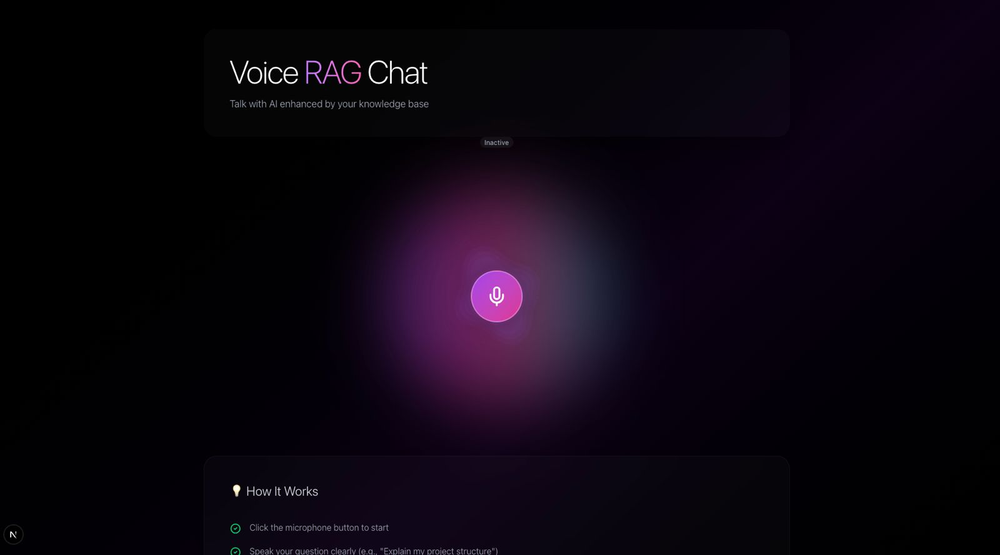
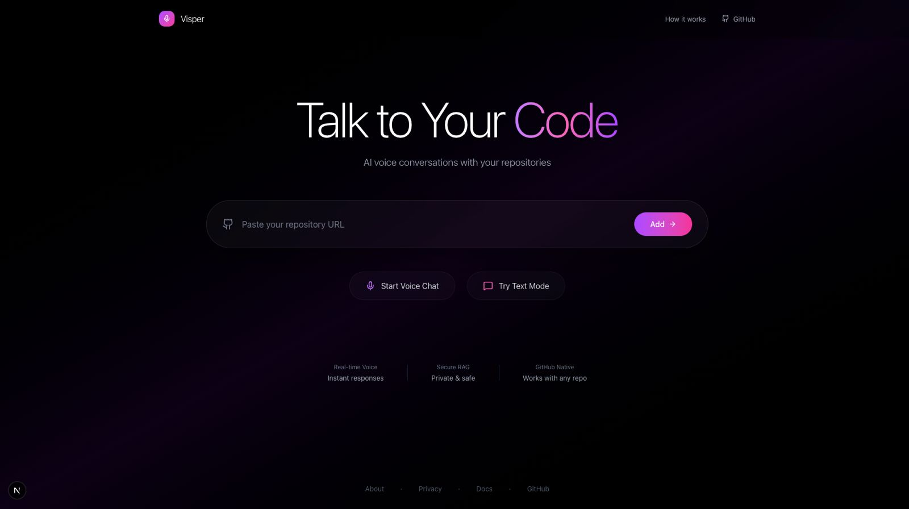

## Visper

Talk to your code. Real‑time voice chat with secure RAG over your repositories.

<p align="center">
  
</p>

<p align="center">
  
</p>

 
## Quick start
1) Install
```
pip install -r requirements.txt
```
2) Auth
- Developer API (images/text):
```
export GOOGLE_API_KEY="YOUR_API_KEY"
export USE_DEVELOPER_API=true
```
- Cloud (TTS + GCS upload):
```
export GOOGLE_APPLICATION_CREDENTIALS="/absolute/path/to/service-account.json"
```
3) Minimal JSON (project.json)
```
{
  "title": "Your/Repo",
  "description": "One‑line project summary.",
  "user_journey": "Short user flow text.",
  "repository": "https://github.com/you/repo",
  "tech_stack": "List or paragraph of tech names"
}
```
4) Run end‑to‑end
```
python run.py all \
  --slides_json project.json \
  --auto_narration \
  --narration_model gemini-2.0-flash-001 \
  --tts_backend cloud \
  --out_dir media \
  --gcs_uri gs://YOUR_BUCKET/slides_with_audio.mp4
```
Output: `media/slide_*.png`, `media/narration_*.wav`, `media/slides_with_audio.mp4`

5) Run the API
```
python main.py
# or: uvicorn visper.api.app:app --reload --port 8000
```
Docs: `http://localhost:8000/docs`

## Models and modes
- Images
  - Default Imagen: Vertex (`imagen-4.0-generate-001`) or Developer API auto‑resolves `imagen‑3.x`.
  - Gemini image models supported if set explicitly:
```
export IMAGE_MODEL="gemini-2.5-flash-image"
```
- Narration
  - Text model (for auto narration): `--narration_model` (default `gemini-2.0-flash-001`).
  - TTS backend: `--tts_backend cloud` (Cloud TTS); ensure API is enabled on your project.

## JSON to slide prompts (dynamic)
Slides are generated per slide (separate calls), derived from fields: `title`, `description`, `user_journey`, `tech_stack`, `repository`. Missing fields fallback to generic, concise phrasing. Auto‑narration produces 1–2 natural explanatory sentences per slide.

## Logo overlay and timing
- Logo overlay on final video:
```
--logo /abs/path/logo.png --logo_scale 0.12 --logo_margin 20
```
- With per‑slide narration, each slide duration equals its audio duration. With a single audio track, use `--seconds` for fixed durations.

## Directory structure (short)
- `visper/`: Python package
  - `api/app.py`: FastAPI app (`from visper.api.app import app`)
  - `pipeline/`: generation pipeline wrappers
    - `images.py`: `init_client`, `generate_images`, `generate_images_for_slides`
    - `tts.py`: `generate_tts`
    - `compose.py`: `compose`, `compose_per_slide`
  - `clients/`: external service clients
    - `github_client.py`: GitHub API client
    - `vectara_client.py`: Vectara client
  - `services/`: higher-level helpers
    - `gemini_enhancer.py`: RAG answer enhancer
  - `utils/github.py`: `parse_github_url`
- `run.py`: Orchestrator CLI (uses `visper.pipeline.*`)
- `main.py`: API entrypoint (re-exports `visper.api.app:app`)
- `agent_router.py`: Receives repo analysis, writes `analysis.json`, can auto-run pipeline
- `agent_visual.py` / `agent_audio.py`: Optional split agents for slides/audio
- `media/`: Outputs (slide PNGs, narration WAVs, final MP4)

## Main features
- JSON-driven slides from 5 fields: title, description, user_journey, tech_stack, repository
- Flexible image models: Imagen (Vertex/Developer) or Gemini (via `IMAGE_MODEL`)
- Auto narration: 1–2 natural sentences per slide (Gemini text) → TTS via Cloud TTS
- Per‑slide sync: each slide waits until its own audio ends
- Optional GCS upload and logo overlay
 - RAG (optional): Vectara can provide retrieved context to enrich slide prompts
 - Agents (optional): Fetch.ai uAgents enable remote repo analysis and pipeline triggering

## Motivation & Accessibility
Visper exists to make engineering knowledge accessible to everyone, especially blind and low‑vision developers.

- Audio‑first: Every visual is paired with clear, synchronized narration.
- Minimal visuals: High‑contrast, low‑clutter slides for screen magnifiers.
- Hands‑free: Voice in/voice out to explore large codebases quickly.
- Grounded: Answers cite sources and link back to files.

## Demo
[Watch the 2‑minute demo on YouTube](https://www.youtube.com/watch?v=ToMe0I_unKM)

[](https://www.youtube.com/watch?v=ToMe0I_unKM)

## How it works
- Input: 5 JSON fields (`title`, `description`, `user_journey`, `tech_stack`, `repository`).
- Prompting: Builds structured, minimal slide prompts per field.
- Image generation: Imagen (default) or Gemini image model renders slides.
- Auto‑narration: Gemini text model writes 1–2 natural sentences per slide.
- TTS: Cloud TTS produces per‑slide WAVs (or a single track if desired).
- Video: Slides + audio are stitched; each slide duration matches its audio.
- Optional: Upload final MP4 to GCS; overlay logo.

## Agents (optional)
- `agent_router.py` requests a repo analysis from a remote agent, saves `analysis.json`, then (if enabled) runs the pipeline automatically:
```
export AUTO_RUN_PIPELINE=true
python agent_router.py
```
Env used: `OUT_DIR`, `TTS_BACKEND`, `NARRATION_MODEL`, `GCS_URI`.

## Troubleshooting
- 401/403 (Cloud): set `GOOGLE_APPLICATION_CREDENTIALS`, enable APIs (Text‑to‑Speech, Generative Language/Vertex), grant roles (TTS User, Service Usage Consumer; Storage Object Admin for GCS).
- 404 model not found (Dev API): set a valid `IMAGE_MODEL` or let auto‑resolve pick an available Imagen 3.x.
- 429 quota: reduce requests or request a quota increase.

## Useful commands
- Compose existing slides + audio:
```
python run.py compose --audio media/narration.wav --out media/slides_with_audio.mp4 --seconds 2.5 --out_dir media
```
- Visual and audio agents (optional):
```
python agent_visual.py --out_dir media
python agent_audio.py --text_file narration_lines.txt --tts_backend cloud --out_dir media
```

## Gemini models used and purpose
- gemini-2.0-flash-001
  - Purpose: Auto‑narration text generation (1–2 sentences per slide) when using `--auto_narration` or `--slides_json`.
  - Where: `run.py` (`--narration_model` flag; defaults to this model).

- gemini-2.5-flash-image (optional)
  - Purpose: Image generation via `generate_content` with inline image parts when you explicitly set `IMAGE_MODEL=gemini-2.5-flash-image`.
  - Where: `generate_slides_with_tts.py` auto‑detects Gemini image models and switches to the Gemini content path.

- gemini-2.5-flash-preview-tts (optional)
  - Purpose: TTS directly via Gemini when `--tts_backend gemini` is used (may require allowlisting); default pipeline uses Google Cloud Text‑to‑Speech instead.
  - Where: `generate_tts.py` (backend selectable via `--tts_backend`).

---

## Built for
Google Gemini Hackathon — TED AI

Links:
- [2025 TED AI Hackathon (Cerebral Valley)](https://cerebralvalley.ai/e/2025-ted-ai-hackathon)
- [TEDAI San Francisco Hackathon](https://tedai-sanfrancisco.ted.com/hackathon/)

## Team
<table>
  <tr>
    <td align="center">
      <a href="https://www.linkedin.com/in/lal-abhay/">
        
        <br />
        <sub><b>Abhay Lal</b></sub>
      </a>
    </td>
    <td align="center">
      <a href="https://www.linkedin.com/in/yash-vishe-903862190/">
        
        <br />
        <sub><b>Yash Vishe</b></sub>
      </a>
    </td>
    <td align="center">
      <a href="https://www.linkedin.com/in/kshitij-dumbre-1b6870175/">
        
        <br />
        <sub><b>Kshitij Akash Dumbre</b></sub>
      </a>
    </td>
    <td align="center">
      <a href="https://www.linkedin.com/in/guruprasad-parasnis-592479213/">
        
        <br />
        <sub><b>Guruprasad Parasnis</b></sub>
      </a>
    </td>
  </tr>
</table>
